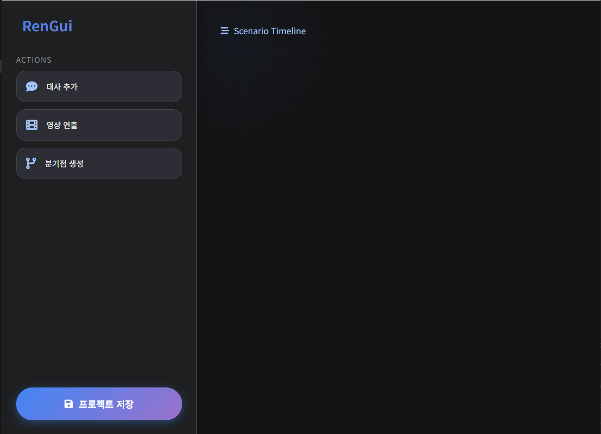

# 🌸 RenGui

<div align="center">


**The Modern, High-Performance Visual Novel Engine written in Go.** 가볍고 강력한 차세대 비주얼 노벨 엔진 & 에디터

[Features](#-key-features) • [Getting Started](#-getting-started) • [Architecture](#-architecture) • [Roadmap](#-roadmap)

</div>

---

## 📖 Introduction

**RenGui** is a lightweight visual novel engine designed to replace Python-based legacy engines. It separates the **Editor (Wails)** and the **Runtime (Ebitengine)**, sharing a standardized JSON data structure.

**RenGui**는 기존의 무거운 스크립트 기반 엔진을 대체하기 위해 탄생했습니다. 코딩 없이 직관적인 GUI 에디터로 시나리오를 작성하고, Go 언어의 강력한 성능으로 어디서든 실행되는 게임을 만드세요.

---

## ✨ Key Features

| Feature | Description |
| :--- | :--- |
| ⚡ **Blazing Fast** | Built with **Go** and **Ebitengine**. Compiles to a single native binary. No heavy runtime required. |
| 🌲 **Tree-based Editor** | Visual node/tree editor using **Wails**. Drag & Drop scenarios, branches, and media. No scripting! |
| 🎬 **Cinematic** | Native support for **VP8/IVF Video Backgrounds**. Create dynamic scenes with moving backgrounds. |
| 🔊 **Rich Media** | Full support for **BGM (Looping)**, **SFX**, and **Character Sprites** (Tachie) positioning. |
| 🌐 **Web Ready** | Designed with **WebAssembly (WASM)** in mind. Run your visual novel directly in the browser. |

---

## 📸 Screenshots

### 🎨 The Editor (Wails)
> Modern Dark UI inspired by Gemini. Manage dialogues, branches, and assets visually.



### 🎮 The Player (Ebitengine)
> High-performance playback with video backgrounds and character sprites.


---

## 🚀 Getting Started

### Prerequisites
* **Go** (1.21 or higher)
* **Node.js & npm** (For Editor frontend)
* **Wails CLI** (`go install github.com/wailsapp/wails/v2/cmd/wails@latest`)

### 1. Clone the repository
```bash
git clone [https://github.com/ron2p/RenGui.git](https://github.com/YOUR_GITHUB_ID/RenGui.git)
cd RenGui
```

### 2. Run the Editor
```bash
cd cmd/editor
go mod tidy
wails dev
```

### 3. Run the Player
```bash
# Open a new terminal from the project root
go mod tidy
go run ./cmd/player
```

---

## 📚 Documentation

For a detailed user manual on how to use the Editor and manage assets, please read the **[User Guide(English)](docs/EN_GUIDE.md)**.   
(에디터 사용법과 자산 관리 방법에 대한 자세한 내용은 **[사용자 가이드(Korean)](docs/KR_GUIDE.md)** 를 참조하세요.).  


---

## 📂 Architecture
RenGui follows a Monorepo structure to keep the Editor and Engine in sync.
```text
RenGui/
├── assets/            # Global Assets (Images, Sounds, Fonts, Sprites)
├── cmd/
│   ├── editor/        # GUI Scenario Editor (Wails + Vanilla JS)
│   └── player/        # Game Runtime (Ebitengine)
├── pkg/
│   └── model/         # Shared Data Structures (GameData, Scene, Dialogue)
├── story.json         # The Scenario Data (Generated by Editor)
└── go.mod             # Go Module Definition
```

---

## 🗺️ Roadmap
• [x] Core Engine: JSON Parser, Text Rendering, Branching Logic.  
• [x] Media Support: VP8 Video(.ivf), MP3/WAV Audio, PNG/JPG Images.  
• [x] Visual Editor: Drag & Drop Timeline, Branch creation, Modern UI.  
• [x] Character System: Standing Tachie (Left/Center/Right).  
• [ ] Save/Load System: In-game state serialization.  
• [ ] Title Screen & Menus: Configurable UI.  
• [ ] Build Tools: One-click deployment for Windows/Mac/Linux/Web.  

---

## 🤝 Contributing
Contributions are welcome! If you have ideas for features or find bugs, please open an issue or submit a pull request.
1. Fork the Project
2. Create your Feature Branch (git checkout -b feature/AmazingFeature)
3. Commit your Changes (git commit -m 'Add some AmazingFeature')
4. Push to the Branch (git push origin feature/AmazingFeature)
5. Open a Pull Request

---

## 👏 Credits

* **Font:** [Pretendard](https://github.com/orioncactus/pretendard) by [Kil Hyung-jin (orioncactus)](https://github.com/orioncactus) (SIL Open Font License)

---
## 📝 License

Distributed under the **MIT License**.

<details>
<summary>Click to view the full license text</summary>

```text
MIT License

Copyright (c) 2025 ron2p

Permission is hereby granted, free of charge, to any person obtaining a copy
of this software and associated documentation files (the "Software"), to deal
in the Software without restriction, including without limitation the rights
to use, copy, modify, merge, publish, distribute, sublicense, and/or sell
copies of the Software, and to permit persons to whom the Software is
furnished to do so, subject to the following conditions:

The above copyright notice and this permission notice shall be included in all
copies or substantial portions of the Software.

THE SOFTWARE IS PROVIDED "AS IS", WITHOUT WARRANTY OF ANY KIND, EXPRESS OR
IMPLIED, INCLUDING BUT NOT LIMITED TO THE WARRANTIES OF MERCHANTABILITY,
FITNESS FOR A PARTICULAR PURPOSE AND NONINFRINGEMENT. IN NO EVENT SHALL THE
AUTHORS OR COPYRIGHT HOLDERS BE LIABLE FOR ANY CLAIM, DAMAGES OR OTHER
LIABILITY, WHETHER IN AN ACTION OF CONTRACT, TORT OR OTHERWISE, ARISING FROM,
OUT OF OR IN CONNECTION WITH THE SOFTWARE OR THE USE OR OTHER DEALINGS IN THE
SOFTWARE.
```


</details>
<div align="center">
<sub>Built with ❤️ using Go, Ebitengine, and Wails.</sub>
</div>
